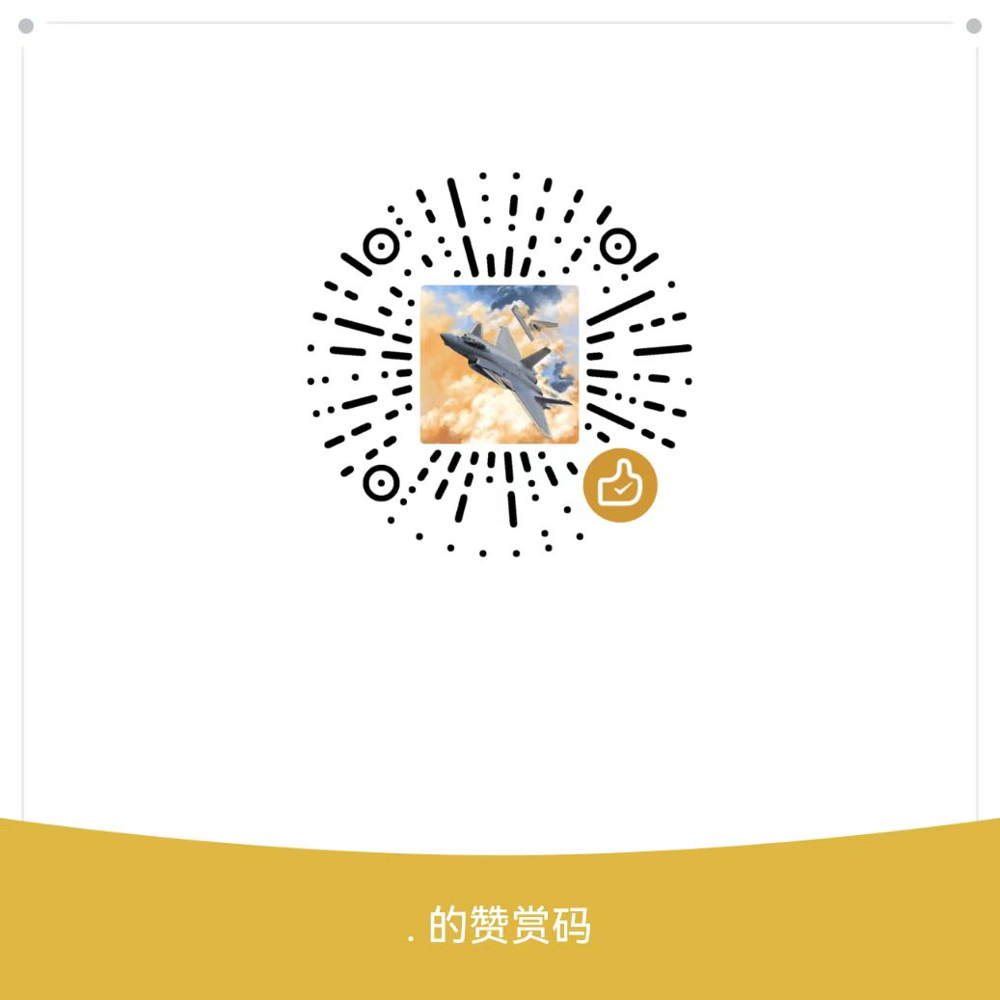

## 环境搭建

1. 搭建环境所需软件：

「pycharm-community-2022.1.1.exe」https://www.aliyundrive.com/s/6rok2fN6aNA

「python-3.7.9-amd64.exe」https://www.aliyundrive.com/s/Z3gVLHaLSWL

2. 视频教程：

「lv_0_20220611232504.mp4」https://www.aliyundrive.com/s/KueJWyyzKfd

上面视频实在看不懂，看下面:

https://zhuanlan.zhihu.com/p/53250337

## liangongbao
练功宝题库每日更新

有任何问题，可加Q群交流:573902536

## 赞赏

觉得不错的话,请我喝杯咖啡吧.
